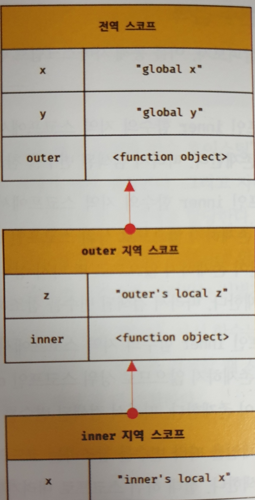

# 12 함수
## 12.1 함수란?
함수란 입력을 받아 출력을 내보내는 일련의 과정을 정의한 것

## 12.3 함수 리터럴
JS에서 함수 리터럴은 function 키워드, 함수는 객체다.

## 12.4 함수 정의
변수는 선언(declaration)한다고 하지만 함수는 정의(definition)한다고 표현한다.

## 12.4 함수 선언문
```js
function add(x,y) {
  return x+y
}
undefined
```
함수 선언문은 표현식이 아닌 문(statement)이다.

반면 아래에서는 표현식으로 표현된다.
```js
var add = function add(x,y) { return x+y } 
```
왜냐하면 자바스크립트 엔진이 코드 문맥에 따라 동일한 함수 리터럴(function)을 표현식이 아닌
함수 선언문으로 해석하는 경우와 표현식으로 해석하는 경우가 있기 때문이다.

예를 들어 {}는 문맥에 따라 객체 리터럴이 될 수 도있고 블록문일 수 도있다.

그룹 연산자 ()에 속해있는 bar은 표현식으로 해석된다. 다만, bar은 호출할 수 없다.

함수 이름은 함수 내에서만 참조할 수 있는 식별자이다. 즉, 외부에서는 참조할 수 없다.

반면에 foo는 참조가 가능하다 왜냐면 자바스크립트 엔진이 암묵적으로 함수 이름과 동일한 식별자를 생성하고, 거기에 함수 객체를 할당한다.
```js
function foo() { console.log('foo') }
(function bar() { console.log('bar') })
foo()// foo
bar()// ReferenceError: bar is not defined

(function bar() { console.log('bar') })() // bar
```
결과적으로 함수는 함수 이름으로 호출하는 것이 아니라 함수 객체를 가리키는 식별자로 호출한다.

## 12.4.2 함수 표현식
자바스크립트의 함수는 값처럼 변수에 할당할 수도 있고 프로퍼티 값이 될 수도 있으며 배열의 요소가 될 수도 있다. 

이러한 성질의 객체를 일급 객체를 한다. 자바스크립트 함수는 일급 객체다.

함수 이름은 함수 몸체 내부에서만 유효한 식별자 이므로 함수 객체를 가리키는 식별자를 호출해야한다.
```js
var add = function foo(x,y) {
  return x+y
}
console.log(add(1,2)) // 3
console.log(foo(1,2)) // ReferenceError: foo is not defined
```
## 12.4.3 함수 생성 시점과 함수 호이스팅
```js
add(2,3) // 호출 가능
test(2,3) // 호출 불가능, TypeError: sub is not a function
function add(x,y) {}
var test = function(x,y) {}
```
함수 선언문으로 정의한 함수와 함수 표현식으로 정의한 함수의 생성시점이 다르다.

함수 선언문으로 정의할 시 런타임 이전에 객체 값까지 생성이 완료된다. 이것을 함수 호이스팅이라 한다.

함수 호이스팅은 함수를 호출하기 전에 반드시 함수를 선언해야 한다는 규칙을 무시하기 때문에 함수 선언문 대신 함수 표현식을 사용할 것을 권장

## 12.4.4 Function 생성자 함수
```js
var add = new Function('x','y', 'return x+y')
console.log(add(2,5)) // 7
```
Function으로 생성한 함수는 클로저를 생성하지 않는 등, 이전과 다르게 동작하므로 사용을 권장하지 않는다.

## 12.5.1 매게변수와 인수
함수의 매개변수보다 인수가 많을 경우 초과된 인수는 무시된다. 단, arguments 객체에 잘 저장되어있다. 

매개변수는 3개 이상 넘지 않는것을 권장. 넘어야 한다면 객체를 사용해 인자를 전달한다.
```js
function add(x,y) {
  console.log(arguments) // [2,5,10,callee: f, Symbol(Symbol.iterator): f]
  return x+y
}
console.log(add(2,5,10))
```
## 12.6 참조에 의한 전달과 외부 상태의 변경
함수의 인자로 객체를 전달해도 객체안의 값은 변경이 가능하다. 이것에 대한 해결책으로는 deep copy를 통해 불변 객체로 만드는 것이다.

외부 상태를 변경, 의존하지 않는 함수를 순수 함수라고 한다.

## 12.7.1 즉시 실행 함수
즉시 싱행 함수를 반드시 그룹 연산자"()"로 감싸 표현식으로 만들어야한다.

그렇지 않으면 ASI에 의해 `function foo(){}(); => function foo(){};();`로 수정된다.

즉시 실행 함수를 사용하기 위해서 () 뿐만아니라 다양한 방법이 있다.
```js
(function () {}()); // 일반적인 방법
(function () {})();
!function() {}();
+function() {}();

(function (a,b){}(1,2))
```
## 12.7.3 중첩 함수
ES6부터 함수정의는 문이 위치할 수 있는 문맥이라면 어디든지 가능하다.(if, for)
## 12.7.4 콜백 함수
함수의 매개변수가 함수라면 이를 콜백 함수라고한다.
그 함수를 전달받은 함수를 고차 함수(HOF)라고 한다. 


# 13 스코프
모든 식별자(변수, 함수, 클래스 이름 등)는 자신이 선언된 위치에 의해 다른 코드가 식별자 자신을 참조할 수 있는 유효 범위가 결정된다. 이를 스코프라 한다. 

만약 자바스크립트 엔진이 두개의 식별자 중에서 어떤 것을 참조해야할 지 결정하는 것을 식별자 결정이라 한다.
## 13.2.1 전역과 전역 스코프
```js
var x='global x'
var y='global y'
function outer() {
  var z='outer, local z'
  console.log(x) // global x
  console.log(y) // global y
  console.log(z) // outer, local z
  function inner() {
    var x='inner, local x'
    console.log(x) // inner, local x
    console.log(y) // global y
    console.log(z) // outer, local z
  }
  inner()
}
outer()
console.log(x) // global x
console.log(z) // ReferenceError: z is not defined, 함수에 속해있는 변수는 그 안에만 속한다.
```
위와 같이 작동한 이유는 자바스크립트 엔진이 스코프 체인을 통해 참조할 변수를 검색했기 때문이다.

스코프 체인은 linked list와 형태가 비슷하다. O(n) 스코프 체인은 실행 컨텍스트의 렉시컬 환경을 단방향으로 연결한 것이다.

식별자를 참조할 때 자바스크립트 엔진은 참조하는 코드의 스코프에서 시작하여 상위 스코프 방향으로 이동하며 찾는다. (하위로는 절대 이동하지 않는다.)
## 13.4 함수 레벨 스코프
var 키워드로 선언된 변수는 오직 함수 블록만을 지역 스코프로 인정한다. 이르 함수 레벨 스코프라 한다.

반면, let, const 키워드는 블록 레벨 스코프를 지원한다. "{}"
## 13.5 렉스컬 스코프
```js
var x = 1 // let으로 바꿔도 아래와 동일한 결과가 나온다.
function foo() {
  var x = 10 // 위에 var x가 이미 선언되어 있다면 x를 let, const는 에러를 띄어주는 것과 다르게 재정의 한다.
  bar();
}
function bar() {
  console.log(x)
}
foo() // 1
bar() // 1
```
위와 같이 값이 나온 이유는 앞서 말했듯이 함수가 정의된 스코프가 곧 상위 스코프이기 때문이다.

1. 함수를 어디서 호출했는지에 따라 함수의 상위 스코프를 결정한다. => 동적 스코프

2. 함수를 어디서 정의했는지에 따라 상위 스코프를 결정한다. => 렉시컬 스코프(JS는 렉시컬 스코프이다!!)

# 14 전역 변수의 문제점
## 14.1.1 변수의 생명 주기
전역 변수의 생명 주기 == App 생명주기

함수 내부 지역 변수 생명 주기 == 함수 생명 주기

만약 함수 안에 var 키워드를 사용하는 식별자가 있어도 함수와 생명주기를 같이한다.

단, 어떤것이 어떤 함수A가 생성한 스코프를 참조하고 있다면 그 스코프는 소멸하지 않고 생존한다.

```js
var x = 'global'
function foo() {
console.log(x) // 만약 let키워드를 쓴다면 참조 에러 발생
var x = 'local'
}
foo() // undefined
console.log(x) // global
```
위의 코드에서 foo 함수 내부에 선언된 지역 변수 x는 foo를 호출하는 순간 선언되었고 undefined로 초기화 되어있다. 따라서 global x가 아닌 local x를 바라본다. 즉, 호이스팅은 스코프를 단위로 동작한다.

만약 var 키워드가 아닌 let 키워드를 사용한다면 참조 에러가 발생한다.
## 14.1.2 전역 변수의 생명 주기
c나 java는 main 함수와 같은 진입점이 있지만 js는 그렇지 않다.

그러므로 전역 변수는 런타임 이전에 곧바로 해석되고 실행된다.

전역 변수는 전역 객체 window의 프로퍼티다. (window, self, this, frames, global) ES11 이후부터는 globalThis로 통일되었다.

node에서는 global이다.

## 14.2. 전역 변수의 문제점
1. 암묵적 결합
코드 어디서는 참조하고 할당할 수 있다. 즉, 암묵적 결합(implicit coupling)을 허용한다.
2. 긴 생명 주기
애플리케이션과 생명주기를 같이하므로 메모리 리소스도 오랜 기간 소비하게 된다.

3. 스코프 체인 상에서 종점에 존재
전역 변수의 검색 속도가 가장 느리다.

4. 네임스페이스 오염
자바스크립트의 가장 큰 문제점 중 하나는 파일이 분리되어 있다고 해도 하나의 전역 스코프를 공유한다는 점이다.(window에 붙음)

## 14.3 전역 변수 사용 억제하는 방법
1. 즉시 실행 함수
즉시 실행 함수로 감싸면 함수의 지역 변수가 된다.
2. 모듈 패턴
모듈 패턴은 클래스를 모방해서 관련있는 변수와 함수를 모아 즉시 실행 함수로 감싼다.

모듈 패턴은 클로저를 기반으로 동작한다.
```js
var Counter = (function() {
  var num=0
  return {
    increase() {
      return ++num
    }
    decrease() {
      return --num
    }
  }
})()
Counter.increase() // 1
Counter.increase() // 2
Counter.decrease() // 1
```
3. 모듈 패턴
ES6 모듈은 파일 자체의 독자적인 모듈 스코프를 제공한다.

모듈 내의 var 키워드 식별자는 더는 전역 변수가 아니며 window 객체의 프로퍼티도 아니다.

```html
<script type="moulde" src="test.src"></script>
```
4. 네임스페이스 객체
전역에 네임스페이스를 담당하는 객체를 생성하고 변수를 프로퍼티로 추가한다. 단, 전역 변수와 다를바가 없다.
```js
var MYAPP={}
MYAPP.name="test"
```

# 15 let, const 키워드와 블록 레벨 스코프
## 15.1 var 키워드로 선언한 변수의 문제점
1. 변수 중복 선언 허용
```js
var x=1
var x=2 // 에러를 발생시키지 않고 x를 재할당한다.
```
2. 함수 레벨 스코프
```js
var x=10
for (var v=0;v<5;v+=1) {}
console.log(x) // 5
```
3. 변수 호이스팅
```js
console.log(f) // undefined
var f=123
console.log(f) // 123
window.f // 123

// 단, var 키워드 사용하지 않으면 단지 프로퍼티로 추가된다. 변수가 아니다.
console.log(f2) // error
f2=123
console.log(f2) // 123
window.f2 //123

delete f // 전역 변수는 삭제되지 않는다.
delete f2 // 프로퍼티는 삭제된다.
```

## 해결 방법
## 15.2 let 키워드
1. 변수 중복 선언 금지
```js
let x=1
let x=2 // SyntaxError: Identifier 'x' has already been declared
```
2. 블록 레벨 스코프
```js
let x=1
{
  let x=2
  console.log(x) // 2
}
console.log(x) // 1
```
3. 변수 호이스팅이 해결된 것 처럼 보인다.
```js
// 변수 선언 단계, JS엔진에 의해 x의 공간이 할당됐다. 다만, var과 다르게 초기화 전 호출시 에러가 발생한다.
console.log(x) // ReferenceError: x is not defined
let x // 변수 초기화 단계 
console.log(x) // undefined
x=1 // 값 할당 단계
console.log(x) // 1
{
  // 에러 메시지가 변경됐다. 즉, 변수 호이스팅이 발생했지만 그렇지 않은 것 처럼 보인다.
  console.log(x) // ReferenceError: Cannot access x before initialization
  let x=2
}
```
let 키워드로 선언한 식별자는 선언 단계, 초기화 단계가 분리되어 진행된다.

즉, JS엔진에 의해 암묵적으로 선언 단계가 먼저 실행되지만 초기화 단계는 변수 선언문에 도달했을 때 실행된다.

변수 선언 단계에서 변수 초기화 단계 전까지를 일시적 사각지대(TDZ)라 부른다.

## 15.3 const 키워드
let 과 방식이 비슷하지만 상수를 지원하기 위해 사용한다.

const 키워드로 선언한 변수는 반드시 선언과 동시에 초기화해야 한다.

const 키워드로 선언된 객체의 프로퍼티 값을 변경할 수 있다, 할당된 객체의 주소값이 바뀌지 못할 뿐이다.

ES6부터는 기본적으로 const 키워드를 쓰다가 필요시 let 키워드를 활용한다.

