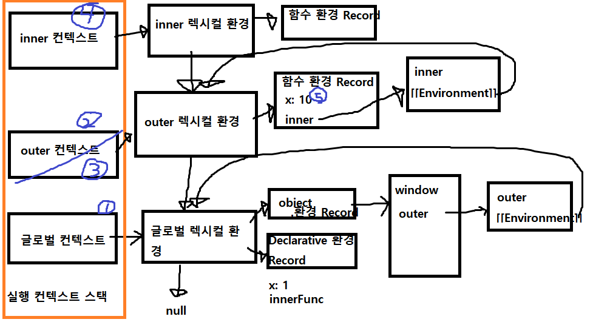

# 24 클로저
클로저는 자바스크립트 고유의 개념이 아니다. 함수를 일급 객체로 취급하는 함수형 프로그래밍 언어에서 사용되는 중요한 특성이다.

클로저는 함수와 그 함수가 선언된 렉시컬 환경과의 조합이다.

클로저는 중첩 함숙 상위 스코프의 식별자를 참조하고 있고 중첩 함수가 외부 함수보다 더 오래 유지되는 경우가 일반적이다. 즉, 클로저여도 외부 식별자 참조하지 않으면 일반적으로 클로저라고 하지 않음

# 24.3 클로저와 렉시컬 환경
```js
const x=1
function outer() {
    const x = 10
    const inner = function() { console.log(x)}
    return inner
}
const innerFunc = outer()
innerFunc()
```
1. x, outer,innerFunc가 window에 등록된다.
2. global, outer 가 실행 컨텍스트에 등록된다.
3. outer가 실행되면 바로 실행 컨텍스트에서 없어진다.
4. innerFunc가 실행 컨텍스트에 등록된다.
5. 실행되고, innerFunc는 outer함수의 렉시컬 환경을 가지고 있기 때문에 10이 출력된다.(클로저)
6. 실행 컨텍스트 스택이 비어진다.


## 24.4 클로저의 활용
1. 상태를 안전하게 변경하고 유지
```js
const increase = (function () {
    let num=0
    return function() {
        return num+=1
    }
}())
console.log(increase())//1
console.log(increase())//2
console.log(increase())//3
```
* NOTE: new 사용시 독립된 렉시컬 환경을 갖는다.
```js
function makeCounter(p) {
    let counter=0
    return function() {
        // 인수인 p에 상태 변경 위임
        counter=p(counter)
        return counter
    }
}
function increase(n) {
    return n+=1
}
const a=makeCounter(increase)
a()//1
a()//2
const b=makeCounter(increase)
b()//1
b()//2
``` 
2. 캡슐화와 정보 은닉

## 24.6 자주 발생하는 실수
```js
// 아래는 3이 3번 출력된다.
var funcs=[]
for (var i=0;i<3;i++) {
    funcs[i]=function(){return i}
}
for (var j=0;j<funcs.length;j++) {
    console.log(funcs[j]())
}
```
문제
1. var i, var 사용으로 인한 전역 변수화
2. function 사용으로 전역 변수 i를 가져오는 점

해결
1. 즉시 실행함수로 인자 넘기기
```js
var funcs=[]
for (var i=0;i<3;i++) {
    funcs[i]=(function(i){return i}(i))
}
for (var j=0;j<funcs.length;j++) {
    console.log(funcs[j])
}
// 0,1,2
```
2. 클로저
```js
var funcs=[]
for (var i=0;i<3;i++) {
    funcs[i]=(function(i){return function() { return i }}(i))
}
for (var j=0;j<funcs.length;j++) {
    console.log(funcs[j]())
}
// 0,1,2
```
3. let i, let 키워드 사용으로 블록 스코프 환경을 만든다.
 

4. 고차 함수 사용
```js
// Array.from array를 shallow copy
const funcs = Array.from(new Array(3), (_,i)=>()=>i)
funcs.forEach(f=>console.log(f()))
```
# 25 클래스
JS에서 클래스는 함수이며 문법적 설탕이라고 보기보다 새로운 객체 생성 메커니즘으로 보는것이 합당하다.

클래스와 생성자 함수 차이점
1. 클래스는 new 연산자를 사용해 호출하지 않으면 에러, 반면 생성자 함수는 원하는 대로
2. 클래스는 extends, super지원
3. 클래스는 호이스팅이 발생하지 않는 것 처럼 보임
4. 클래스 내의 모든 코드는 암묵적으로 strict mode 지정
5. 클래스의 모든 프로퍼티는 [[Enumerable]]이 false이다, 즉 열거되지 않는다.

## 25.2 클래스 정의
```js
class Person {}

// 익명 클래스 표현식
const Person = class {}
// 기명 클래스 표현식
const Person = class MyClass {}
```
클래스는 일급 객체이다.
1. 무명의 리터럴로 생성할 수 있다. 즉, 런타임에 생성 가능하다
2. 변수나 자료구조에 저장할 수 있다.
3. 함수의 매개변수에 전달할 수 있다.
4. 함수의 반환값으로 사용할 수 있다.


## 25.3 클래스 호이스팅
```js
console.log(Person) // ReferenceError: Cannot access 'Person' before initialization
class Person{}
``` 
**Chrome에서 확인해보니 not def 에러나옴 위에 내용 확인 필요.**
## 25.5.1 constructor
생략 가능하다. - 암묵적으로 constructor 정의 됨

중복되면 안된다.

## 25.5.2 프로토타입 메서드
클래스에 메서드 생성시 prototype을 추가하지 않아도 기본적으로 prototype 메서드가 된다.

class의 상위 프로토타입은 Object이다.

인스턴스는 class의 프로토타입 체인에 추가된다.

```js
class Person {
    constructor(name){
        this.name=name
    }
    sayHi(){
        console.log(`Hi! my name is ${this.name}`)
    }
}
const me = new Person('Lee')
me.sayHi() // Hi! my name is Lee

// me.__proto__, me는 Person의 프로토타입 체인에 연결되어있다.
Object.getPrototypeOf(me) === Person.prototype // true
me instanceof Person // true

// 클래스의 상위 프로토타입은 Object이다.
Object.getPrototypeOf(Person.prototype) === Object.prototype // true
me instanceof Object // true

me.constructor === Person // true
```
 
## 25.5.3 정적 메서드
정적 메서드는 인스턴스를 생성하지 않아도 호출할 수 있는 메서드를 말한다.
```js
// 생성자 함수에서 정적 메서드
function Person(name) {
    this.name=name
}
Person.sayHi = function () {
    console.log('Hi!')
}
Person.sayHi() // Hi!
```
```js
class Person {
    constructor(name){
        this.name=name
    }
    static sayHi() {
        console.log('Hi')
    }
}
Person.sayHi() // Hi!
```
 
정적 메서드는 인스턴스로 호출할 수 없다. 왜냐면 정적 메서드가 바인딩된 클래스에는 인스턴스의 프로토타입 체인상에 존재하지 않기 때문이다. 또한 인스턴스 클래스의 메서드를 상속받을 수 없다.
```js
const me = new Person('Lee')
me.sayHi()// error
```
## 25.5.4 정적 메서드와 프로토타입 메서드의 차이
1. 정적 메서드와 프로토타입 메서드는 자신이 속해 있는 프로토타입 체인이 다르다.
2. 정적 메서드는 클래스로 호출하고 프로토타입 메서드는 인스턴스로 호출한다.(new 사용해서)
3. 정적 메서드는 인스턴스 프로퍼티를 참조할 수 없지만 프로톹타입 메서드는 인스턴스 프로퍼티를 참조할 수 있다.

장점: 정적 메서드는 인스턴스를 만들지 않고 바로 쓸 수 있어 편하다.
## 25.7.3 클래스 필드 정의 제안
자바스크립트의 클래스 몸체에서는 메서드만 선언할 수 있다.
```js
class Person {
    name='Lee'
}
const me = new Person('LEE')
```
하지만 Chrome 72, Node 12이상부터는 가능하다.

## 25.7.4 private 필드 정의 제안
js에서 private 필드를 만드려면 #을 붙여준다. 예: #name 단, constructor에서는 #을 사용할 수 없다.
```js
class Person {
    #name='Lee'
}
const me2 = new Person('LEE')
me2.#name // Uncaught SyntaxError: Private field '#name' must be declared in an enclosing class
```

## 25.8.2 extends 키워드
```js
class Base{}
class Derived extneds Base {}
// 생성자도 상속 가능하다
function Base(a){
    this.a=a
}
class Derived extends Base {}
const derived = new Derived(1)
console.log(derived) // Derived { a:1}

// 조건 상속도 가능하다.
class Derived extends (true ? Base : Base2) {
    ...
}
```

## 25.8.5 super 키워드
1. super을 호출하면 수퍼클래스의 constructor를 호출한다.
2. super을 참조하면 수퍼클래스의 메서드를 호출할 수 있다.
```js
class Base {}
class Derived extends Base {
    // constructor(...agrs) { super(...args)}  // 암묵적으로 호출된다. 단, 서브클래스에서 constructor을 생략하지 않으면 명시적으로 super을 호출해야 한다.
}
```
3. 서브클래스의 constructor에서 super을 호출하기 전에는 this를 참조할 수 없다.
4. super는 반드시 서브클래스의 constructor에서만 호출한다.
5. 메서드 내에서 super을 참조하면 수퍼클래스의 메서드를 호출할 수 있다.

```js
class Base {
    constructor(name){
        this.name=name
    }
    sayHi() {
        return `hi ${this.name}`
    }
}
class Derived extends Base {
    sayHi() {
        const __super=Object.getPrototypeOf(Derived.prototype)
        return `${__super.sayHi.call(this)}`
    }
}
const derived = new Derived('Lee')
console.log(derived.sayHi()) // hi Lee
```
위의 call(this)을 사용하는 이유

Derived의 this는 생성할 인스턴스를 가리킴

Base.this도 생성할 인스턴스를 가리킴

근데 Object.getPrototypeOf(Derived.prototype) 함수 사용해 Base.prototype가져옴

__super.sayHi는 Base.prototype의 함수 호출하기 때문에 인스턴스의 name에 접근 못 함 this.name은 undef나오게 되고

hi Lee가 나오게 하려면 call(this)사용해야 함

JS에서는 super을 사용하면 위와 같이 프로토타입 체인에서 프로퍼티를 찾는데, 이 때에 주어진 메서드의 내부 슬롯[[HomeObject]]에서 그 값을 찾는다.

그렇게하여 this는 인스턴스를 가리키면서 super을 사용해 바로 프로퍼티를 찾는다.

주의할 것은 ES6 메서드 축약 표현만 [[HomeObject]]를 갖는다.

## 25.8.6 상속 클래스의 인스턴스 생성 과정
JS 엔진은 수퍼클래스와 서브클래스를 구분하기 위해 [[ConstructorKind]]를 갖는다.

서브클래스는 자신이 직접 인스턴스를 생성하지 않고 수퍼클래스에게 인스턴스 생성을 위임한다.

이것이 바로 서브클래스의 constructor에서 반드시 super을 호출해야 하는 이유다.

super가 호출되지 않으면 인스턴스가 생성되지 않으며, this 바인딩도 할 수 없다.

## 25.8.7 표준 빌트인 생성자 함수 확장
클래스뿐만이 아니라 [[Construct]] 속성을 갖고있는 객체도 extends 키워드를 사용할 수 있다.
```js
class MyArray extends Array {
    uniq() {
        return this.filter((v,i,self) => self.indexOf(v)===i)
    }
    average() {
        return this.reduce((pre, cur) => per+cur, 0) / this.length
    }
}
const myArray = new MyArray(1,1,2,3)
console.log(myArray) // [1, 1, 2, 3]
console.log(myArray.uniq()) // [1, 2, 3]
console.log(myArray.average()) // 1.75

// filter가 MyArray를 반환하므로 메서드 체이닝도 가능하다.
console.log(myArray.filter(v=>v%2).uniq().average())
```

만약 MyArray 클래스의 uniq메서드가 MyArray 클래스가 생성한 인스턴스가 아닌 Array를 반환하게 하려면 Symbol.species를 사용하여 정적 접근자 프로퍼티를 추가한다.
```js
class MyArray extends Array {
    // 모든 메서드가 Array 인스턴스를 반환하도록 한다.
    static get [Symbol.species]() { return Array }
    ...
}
```

# 26 ES6함수의 추가 기능
## 26.1 함수의 구분
ES6이전에는 메서드의 정의가 다양했다. ES6 이전의 모든 함수는 일반 함수로서 호출할 수 있는 것은 물론 생성자 함수로서 호출할 수 있다.
```js
var foo = function(){}
foo()
new foo()

var obj={
    f: function() {}
}
obj.f()
new obj.f()

[1,2,3].map(function (item) {
    return item*2
})
```
객체에 바인딩된 함수가 constructor라는 것은 불필요하게 prototype 객체도 생성한다는 것을 의미한다.

그러나 ES6이후 부터는 함수를 사용 목적에 따라 세 가지 종류로 명확히 구분했다.
```
ES6 함수의 구분     constructor     prototype     super                 arguments
일반 함수           O               O               X                       O
메서드              X               X               O[[HomeObject]]         O
화살표 함수         X               X               X                       X
```  

## 26.2 메서드
ES6 사양에서 메서드는 메서드 축약 표현으로 정의된 함수만을 의미한다.
```js
const obj = {
    foo() { return this.x },
    // 다음은 ES6 이후부터는 메서드가 아니다.
    bar: function() {}
}
new obj.foo()
// Uncaught TypeError: obj.foo is not a constructor at <anonymous>:1:1
new obj.bar()
// bar {}
```

ES6 메서드는 자신을 바인딩한 객체를 가리키는 내부 슬롯 [[HomeObject]]를 갖고, 이로인해 super을 사용할 수 있다.

메서드를 정의할 때 프로퍼티 값으로 익명 함수 표현식을 할당하는 ES6 이전의 방식은 사용하지 않는것이 좋다.

## 26.3 화살표 함수
```js
() => {}
```
화살표 함수는 표현만 간략한 것이 아니라 내부 동작도 기존의 함수보다 간략하다.

## 26.3.2 화살표 함수와 일반 함수의 차이
1. 화살표 함수는 non-constructor이다. 
2. prototype이 없다.
3. strict mode가 아닌 일반함수에서는 허용됐지만, 중복된 매개변수 이름을 선언할 수 없다.
4. this, arguments, super, new.target 바인딩을 갖지 않는다.
## 26.3.3 this
화살표 함수에서 this 사용시 상위 스코프의 this를 사용한다. 이를 lexical this라 한다.
```js
const foo = () => this
foo() // window

(function () {
    const foo = () => this
    foo() // { a: 1}
}).call({ a: 1})
```
call, apply, bind 사용시 교체할 수 없고 언제나 상위 스코프의 this 바인딩을 참조한다.

객체 안의 화살표 함수 안의 this는 window를 가리키므로 사용 권장하지 않는다.
```js
const person = {
    name: 'lee',
    sayHi:()=>console.log(`Hi ${this.name}`)
}
person.sayHi() // Hi 
```
이 경우 ES6 메서드 축약 표현을 사용하라.

프로토타입 객체의 프로퍼티에 화살표 함수를 할당하는 경우도 동일한 문제가 발생한다.
```js
function Person(name) {
    this.name=name
}
Person.prototype.sayHi=()=>console.log(`Hi, ${this.name}`)
const person=new Person('lee')
person.sayHi() // Hi,
```
일반 함수가 아닌 ES6 메서드를 동적 추가하고 싶다면...
```js
// 객체도 상속이 가능하다.
function Person(name) {
    this.name=name
}
Person.prototype = {
    constructor: Person,
    sayHi() { console.log(`Hi ${this.name}`)}
}
const person = new Person('lee')
person.sayHi() // Hi Lee
```
클래스 필드에 화살표 함수를 할당할 수 있지만, 좋지 않다.
```js
class Person {
    name='Lee',
    sayHi=()=>console.log(`Hi ${this.name}`)
}
const person=new Person()
person.sayHi() // Hi Lee
```

클래스 필드에 할당한 화살표 함수의 this는 프로토타입 메서드가 아니라 인스턴스 메서드가 된다.

## 26.3.4 super
화살표 함수의 super는 상위 스코프의 super를 참조한다.

## 26.3.5 arguments
마찬가지로 상위 스코프를 참조한다.
## 26.4 Rest 파라미터
1. Rest 파라미터는 함수에 전달된 인수들의 목록을 배열로 전달받는다.

2. Rest 파라미터는 반드시 마지막 파라미터이어야 한다.

3. Rest 파라미터는 함수 정의 시 선언한 매개변수 개수를 나타내는 함수 객체의 length 프로퍼티에 영향을 주지 않는다.
```js
function foo(...rest) {}
console.log(foo.length) // 0

function foo(x,...rest) {}
console.log(foo.length) // 1
```

4. Rest 파라미터에는 기본값을 지정할 수 없다.

* NOTE: 기본 값은 arguments에 영향을 끼치지 않는다.
